## 一 引言

### 1.1 SOH定义

锂离⼦电池SOH描述的是当前锂离⼦电池相对于全新锂离⼦电池的⽼化程度。随着锂离⼦电池在使⽤过程中的⽼化，锂离⼦电池的性能将出现恶化，其主要表现为锂离⼦电池容量的衰减和内阻的增加。因此，常将锂离⼦电池容量和内阻作为锂离⼦电池SOH估算指标。分别从容量和内阻的⻆度定义SOH为

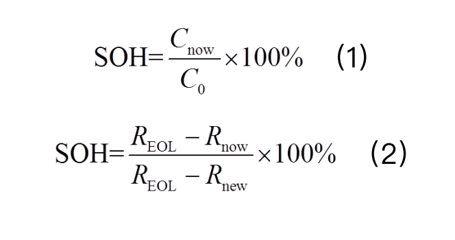

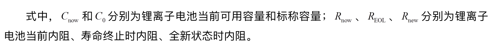

获取锂离子电池的SOH，方法有多种，包括直接测量法、基于模型的⽅法和基于数据驱动⽅法。

我们采用基于数据驱动方法。基于数据驱动⽅法的锂离⼦电池SOH估算⽆需考虑锂离⼦电池⽼化机理和内部电化学反应，通过锂离⼦电池各种⽼化测试中所获取的数据，便能实现锂离⼦电池SOH估算，主要包括⽀持向量机（Support Vector Machine, SVM）、模糊逻辑（Fuzzy Logic,FL）、⾼斯过程回归（Gaussian Process Regression, GPR）、神经⽹络（NeuralNetwork, NN）等，是⼀种实⽤性较强的SOH估算⽅法。

### 1.2 神经网络（Neural Network）

神经网络是一种机器学习方法，其灵感来自人脑中神经元间信号传递的方式。神经网络特别适用于非线性关系建模，通常用于执行模式识别，以及对语音、视觉和控制系统中的目标或信号进行分类。

神经网络，特别是深度神经网络，以其在复杂识别应用中的出色表现而闻名，例如人脸识别、文本翻译和语音识别等应用。此类方法是推动高级驾驶辅助系统及其任务（包括车道分类和交通标志识别）创新的关键技术。

### 1.3 卷积神经网络（Convolutional Neural Network，CNN）

卷积神经网络（Convolutional Neural Network，CNN）是一种特殊类型的神经网络，主要用于处理具有网格结构数据的任务，如图像和视频。CNN 的核心思想是利用卷积层和池化层来自动提取输入数据中的特征，并通过全连接层进行分类或预测。

卷积层（Convolutional Layer）在输入数据上应用卷积操作，通过滑动一个小的窗口（称为卷积核或滤波器）来提取局部特征。这样可以有效地捕捉到输入数据的空间结构信息，例如图像中的边缘、纹理等。

池化层（Pooling Layer）用于减小特征图的尺寸，并保留最显著的特征。常用的池化操作包括最大池化（Max Pooling）和平均池化（Average Pooling）。

在卷积神经网络中，多个卷积层和池化层可以堆叠在一起，形成一个深层网络结构。这些层级的堆叠使得网络可以逐渐学习到更加抽象和复杂的特征，从而提高对输入数据的表达能力。最后，通过全连接层将提取到的特征映射到最终的输出类别或预测结果。

卷积神经网络在计算机视觉领域取得了显著的成功，广泛应用于图像分类、目标检测、图像生成等任务。它的特点是能够自动学习到输入数据的特征表示，并具有对平移、缩放和旋转等变换具有一定的鲁棒性。

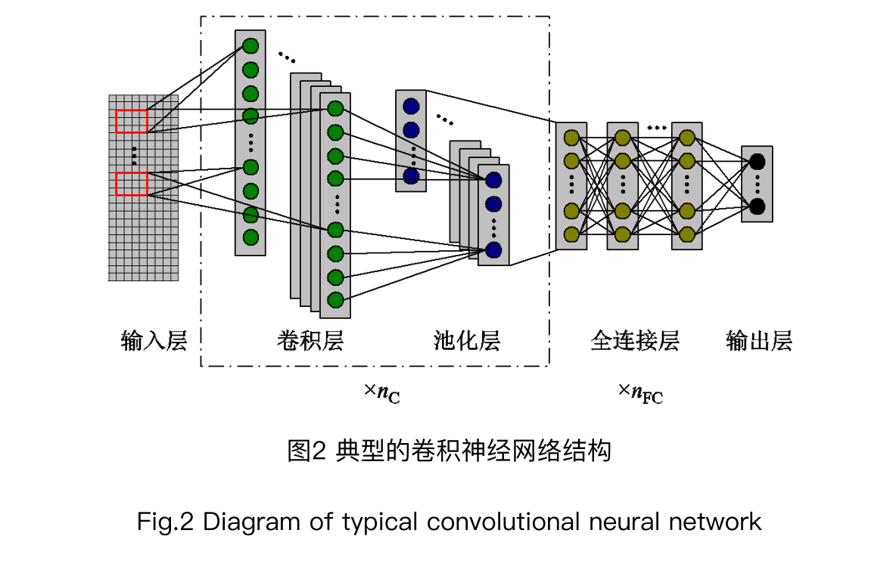

## 二 实验目标

利用实验室的数据集，训练出一个神经网络模型，并尝试应用于生产中。

## 三 实验过程

### 3.1 原始数据集

我们获取到.....

数据集目录结构

```tree
├── 3号电池.xlsx
├── 4号电池.xlsx
├── 5号电池.xlsx
├── 6号电池.xlsx
├── 7号电池.xlsx
├── 8号电池.xlsx
├── 9号电池.xlsx
├── 10号电池.xlsx
├── 11号电池.xlsx
├── 12号电池.xlsx
└── 循环数据汇总.xlsx
```

我们先看`循环数据汇总`

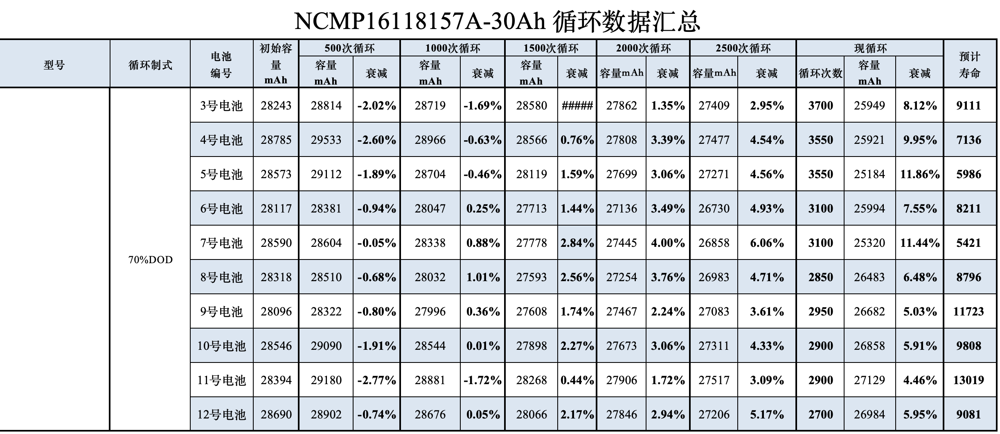

可以获取到每块电池在多次循环后的衰减情况，并且预测到电池的预计寿命。

我们以3号数据为例，列出其详细表头。

```
第1循环								记录序号	测试时间	步骤时间	电流/A	容量/Ah	比容量/mAh/g	SOC|DOD/%	电压/V	能量/Wh	比能量/Wh/kg	辅助温度/℃	辅助电压/V	系统时间	A004_1/℃	循环序号	工步序号	工步状态
...
```

可以获取到在每次循环下，电流、电压等关键数据随着时间的变化情况。

通过原始数据集，我们可以定位到：

输入参数：`步骤时间`, `电流/A`, `电压/V`,`'辅助温度/℃`

输出参数: `SOH`

### 3.2 数据预处理

#### 3.2.1 保留需要参数

由于数据量较大，程序处理有压力，我们采用：用则保留、不用则删除的方法，即指只保留需要的数据：

```
测试时间	步骤时间	电流/A	容量/Ah	电压/V	辅助温度/℃	工步状态
```

`工步状态`标识当前状态是充电、静置、放点等状态，我们保留`CCC`（快充）和`CVC`（慢充）两种状态 。

#### 3.2.2 数据清洗

首先对数据进行归一化处理，将测试时间和步骤时间归一化，并将日期结构转换为秒。

接着将放电深度为100的循环分别单独写入excel，方便之后模型训练和观察参数指标。

```
.
├── 第_1043_循环.xlsx
├── 第_1044_循环.xlsx
├── 第_107_循环.xlsx
├── 第_108_循环.xlsx
├── 第_1095_循环.xlsx
├── 第_1096_循环.xlsx
├── 第_1147_循环.xlsx
...
```

### 3.3 影响因子分析

我们初步确定影响因子为：`电流/A`, `电压/V`,`'辅助温度/℃`，在经过简单数据清洗后，我们给出三种影响因子的时间序列曲线（以3号电池为例）

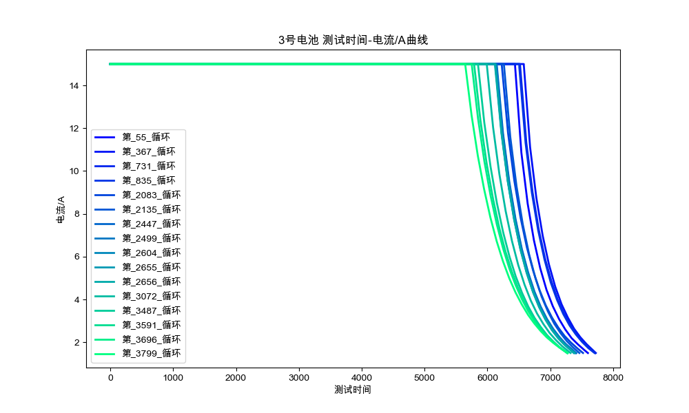

电流曲线可以观察到，在随着每次循环测试时间的变化，循环次数增加时，`CCC`阶段和`CVC`阶段需要的时间变短，即电池随着循环次数增大，电池的实际容量变下，即电池的SOH降低。

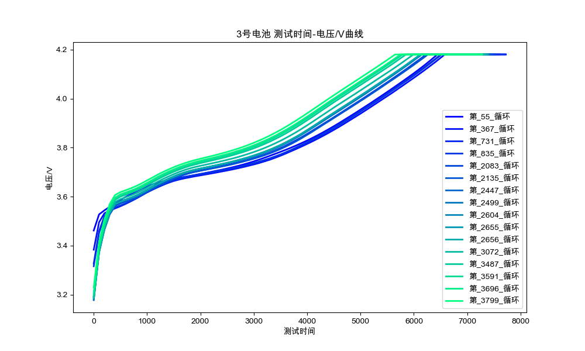

电压曲线可以观察到，在随着每次循环测试时间的变化，循环次数增加时，`CCC`阶段和`CVC`阶段需要的时间变短，即电池随着循环次数增大，电池的实际容量变下，即电池的SOH降低。

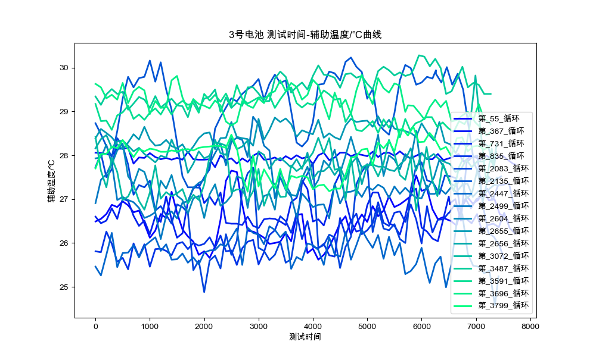

辅助温度曲线我们并未观察到随着循环增加的一个趋势，是因为实验室给的辅助温度指的是实验环境温度，并非电池电芯的温度。

在本次的实验中，我们了解到电芯温度是影响SOH的一个不可或缺的因素，所以我们并没有抛弃温度这个影响因子（为之后线上数据模型训练预留）。

但是可以观察到，在每次循环，实验环境温度都在25-30摄氏度之间，即室温条件，即可减少由于温度对电芯温度的干扰。

### 3.4 目标变量

我们实验的目标变量为SOH即电池的健康度，通过公式：

SOH = (实际容量/标定容量) * 100%

得出，以3号电池为例，我们已知3号电池的标定容量为`28.243`Ah，即计算出每次循环的SOH。

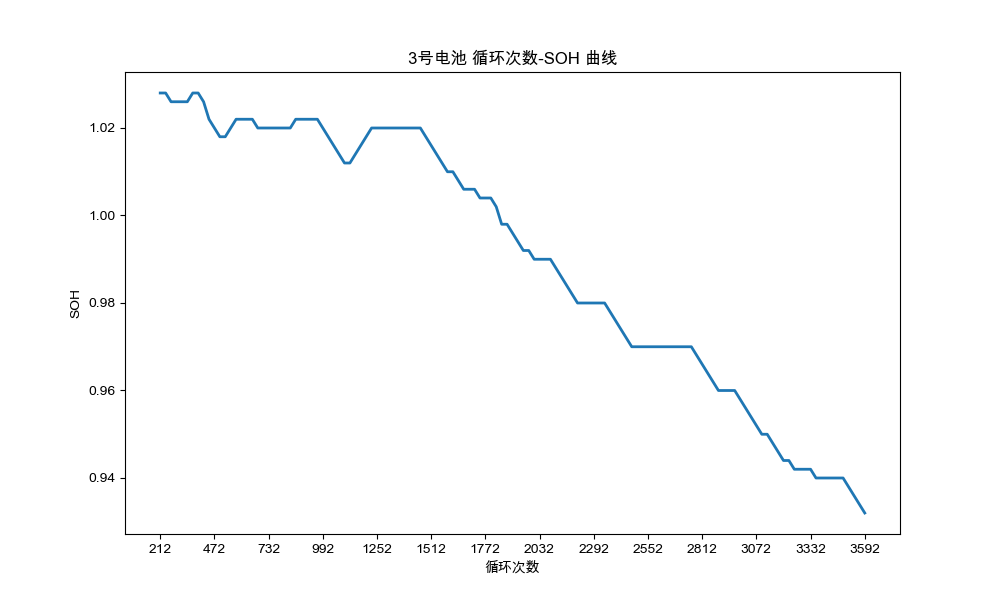

可以观察到随着循环次次数增加，SOH总体呈递减趋势，在3500次循环左右，SOH降到90%出头，与实验室给出结论一致。

### 3.5 模型训练

#### 3.5.1 数据整合

我们将所有电池循环，随着时间序列整合到一个excel，

```
测试时间	步骤时间	电流/A	容量/Ah	电压/V	辅助温度/℃	工步状态
....
....
测试时间	步骤时间	电流/A	容量/Ah	电压/V	辅助温度/℃	工步状态
....
```

#### 3.5.2 模型训练

给出关键步骤：

```python
# 选择需要的参数
features = df[['步骤时间', '电流/A', '电压/V', '辅助温度/℃']]
labels = df['SOH']  # "SOH"是我们的目标变量
```

设置参数和目标参数。

```python
# 将数据分割成训练集和测试集
X_train, X_test, y_train, y_test = train_test_split(features, labels, test_size=0.2, random_state=42)
```

将数据分割成训练集和测试集，test_size=0.2，即测试集设置20%，训练集为80%，典型的二八划分。

```python
# 标准化数据
scaler = StandardScaler()
X_train = scaler.fit_transform(X_train)
X_test = scaler.transform(X_test)

# 将数据重塑为CNN模型所需的形状
X_train = X_train.reshape((X_train.shape[0], X_train.shape[1], 1))
X_test = X_test.reshape((X_test.shape[0], X_test.shape[1], 1))
```

数据标准化并规范格式。

```python
# 创建模型
model = Sequential()
model.add(Conv1D(filters=64, kernel_size=3, activation='relu', input_shape=(X_train.shape[1], 1)))
model.add(MaxPooling1D(pool_size=2))
model.add(Flatten())
model.add(Dense(50, activation='relu'))
model.add(Dense(1))

# 编译模型
model.compile(optimizer='adam', loss='mse')
```

创建模型并编译模型。

1. 卷积层（Conv1D）：通过设置不同的滤波器（filters）和卷积核大小（kernel_size），从输入数据中提取特征。在这段代码中，使用了64个滤波器和大小为3的卷积核。
2. 池化层（MaxPooling1D）：用于降低特征图的维度，减少模型的参数数量。在这段代码中，使用了大小为2的池化核。
3. 扁平化层（Flatten）：将多维的特征图转换为一维向量，以便连接到全连接层。
4. 全连接层（Dense）：通过连接所有神经元来学习输入数据的非线性关系。在这段代码中，使用了一个具有50个神经元的隐藏层，并在最后添加了一个神经元用于回归任务。

```python
# 添加EarlyStopping和ModelCheckpoint回调函数：EarlyStopping用于提前停止训练，ModelCheckpoint用于保存模型
callbacks = [
  EarlyStopping(patience=10, restore_best_weights=True),
  ModelCheckpoint('./models/model.h5', save_best_only=True)
]
```

添加EarlyStopping和ModelCheckpoint回调函数

使用均方误差（Mean Squared Error，MSE）作为损失函数，并使用Adam优化器进行模型的训练。训练过程中使用了EarlyStopping和ModelCheckpoint回调函数，用于提前停止训练和保存最佳模型。

```python
# 训练模型
history = model.fit(X_train, y_train, epochs=100, validation_split=0.2, callbacks=callbacks, verbose=0)

# 打印模型总结
model.summary()

# 评估模型
loss = model.evaluate(X_test, y_test, verbose=0)
print('Test loss:', loss)

# 查看其他评估指标
predictions = model.predict(X_test)
mae = mean_absolute_error(y_test, predictions)
r2 = r2_score(y_test, predictions)
print('Test MAE:', mae)
print('Test R^2:', r2)
```

训练模型并打印评估指标。

```python
# 中文显示
plt.rcParams['font.sans-serif'] = ['Arial Unicode MS']
# 绘制损失值变化图
plt.plot(history.history['loss'], label='训练损失')
plt.plot(history.history['val_loss'], label='验证损失')
plt.xlabel('迭代次数')
plt.ylabel('损失值')
plt.title('损失值变化')
plt.legend()
plt.show()

# 保存模型
model.save('./models/save_model.h5')

# 保存scaler
dump(scaler, './scalers/scaler.joblib')
```

最后打印损失值历史变化即保存模型。

以3号电池为例，打印出模型总结。

```python
Model: "sequential"
_________________________________________________________________
Layer (type)                 Output Shape              Param #   
=================================================================
conv1d (Conv1D)              (None, 2, 64)             256       
_________________________________________________________________
max_pooling1d (MaxPooling1D) (None, 1, 64)             0         
_________________________________________________________________
flatten (Flatten)            (None, 64)                0         
_________________________________________________________________
dense (Dense)                (None, 50)                3250      
_________________________________________________________________
dense_1 (Dense)              (None, 1)                 51        
=================================================================
Total params: 3,557
Trainable params: 3,557
Non-trainable params: 0
```

接着看下损失值、平均绝对误差、R平方

```python
# 损失值衡量模型的误差，越接近0效果越好
Test loss: 0.00026206125039607286
# 平均绝对误差（MAE）衡量了预测值与真实值之间的平均绝对差异，它是预测误差的平均值，数值越小表示模型的预测越准确。
Test MAE: 0.001220840908078062
# R平方（R^2）是一个统计指标，用于衡量预测模型对观测数据的拟合程度。R^2的取值范围在0到1之间，数值越接近1表示模型的拟合效果越好。
Test R^2: 0.9589127494514692
```

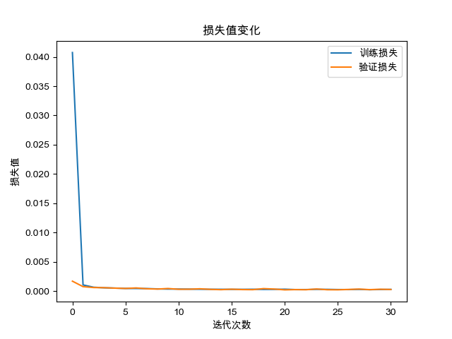

可以看到损失值随着迭代次数的变化无限接近于0，即随着迭代次数的增加，模型越来越准确。

### 3.6 模型验证

我们用4-12号电池，每个电池随机抽样100次循环，进行模型简单验证。

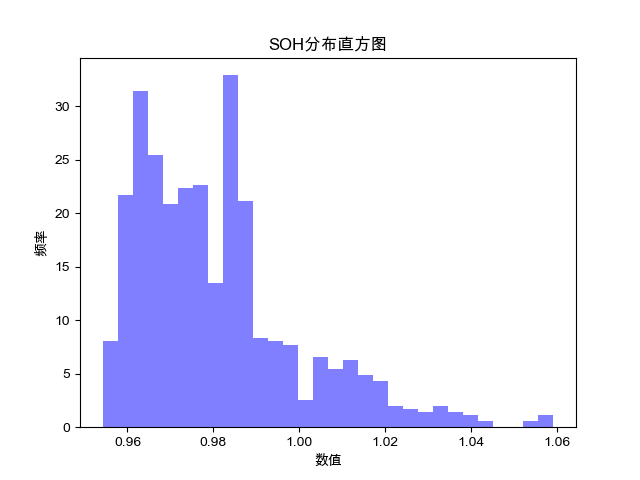


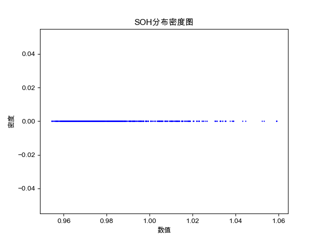

可以使用模型预测的soh集中在90以上，证明了模型的稳定性以及较好的准确性。

## 四 模型应用

首先不管是否使用神经网络 还是简单的程序 计算我们都 需要足够多的原始数据。

影响SOC速度指标的主要 外在因素就是电池 的循环次数，充电的环境温度，充电 的电压电流

1. 循环次数 我们可以 按批次+型号来锚定
2. 环境温度我们可以 以5摄氏度为单位进行采样
3. 充电的电压和电流咱们换电柜子相对稳定

先看下我们已有数据

~~~ sql
create table cos_power_report_db.battery_runtime_tb
(
    battery_pid                   String comment '电池出厂编号',
    receive_time                  DateTime comment '接收时间',
    total_voltage                 Decimal(5, 2) comment '电池总电压',
    current                       Decimal(4, 1) comment '电池电流',
    status                        Int8 comment '电池状态：0x01:静置；0x02:放电；0x03:充电；0x04加热并充电；0x05：只加热未充电',
    voltage_count                 Int8 comment '电芯电压数量（1-32）',
    voltages                      String comment '电芯电压列表，数组',
    temperature_count             Int8 comment '电池温度数量（1-10）',
    temperatures                  String comment '电池温度列表，数组',
    heat_film_temperature_count   Int8 comment '加热膜温度数（0-2）',
    heat_film_temperatures        String comment '加热膜温度列表，数组',
    environment_temperature_count Int8 comment '环境温度数（0-1）',
    environment_temperatures      String comment '环境温度列表，数组',
    mos_temperature_count         Int8 comment 'MOS温度数（0-2）',
    mos_temperatures              String comment 'MOS温度列表，数组',
    highest_voltage               Decimal(6, 3) comment '电池组最高单体电压',
    lowest_voltage                Decimal(6, 3) comment '电池组最低单体电压',
    average_voltage               Decimal(6, 3) comment '电池组平均单体电压',
    voltage_diff                  Decimal(6, 3) comment '压差',
    highest_temperature           Int16 comment '电池组最高电池温度',
    lowest_temperature            Int16 comment '电池组最低电池温度',
    total_capacity                Int32 comment '累计放电容量，预留',
    rated_capacity                Int16 comment '额定容量，预留',
    remain_capacity               Int16 comment '剩余容量，预留',
    soc                           Int8 comment '剩余容量',
    charge_mos_status             Int8 comment '充电MOS状态   1-闭合 0-断开 ',
    dis_charge_mos_status         Int8 comment '放电MOS状态  1-闭合 0-断开 ',
    heat_mos_status               Int8 comment '加热MOS状态   1-闭合 0-断开',
    lock_status                   Int8 comment '锁状态，1 开锁，0 锁定',
    circulate_count               Int32 comment '循环次数',
    highest_voltage_no            Int8 comment '最高电压编号',
    lowest_voltage_no             Int8 comment '最低电压编号',
    lowest_temperature_no         Int8 comment '最低温度编号',
    highest_temperature_no        Int8 comment '最低温度编号',
    create_time                   DateTime64(3) default now64(3) comment '创建时间'
)
~~~

原始数据采样方案，影响最小的方案是使用现有上报数据进行查找，但不一定有满足需求的数据，并且采样数据也涉及到更新。所以我们建议采用主动 采样
1. 指定要采样的型号和批次
2. 捕获电池 上报数据，当发现待采样电池，且当前 soc小于10%时，当前温度也没有采样数据。【温度使用仓温不要使用电池上报温度】
3. 锁定该仓不让进行换电，直到电池soc充到100%。

通过以上方案得到以下采样结果数据表：

| 型号批次，主要考虑不同容量或不同工艺问题 | 运营时长，半年为单位 | 温度，间隔5摄氏度 | soc值，间隔1% | 充满耗时 |
| ---------------------------------------- | -------------------- | ----------------- | ------------- | -------- |
| a001                                     | 0                    | 25                | 50%           | 120min   |
| a001                                     | 0                    | 25                | 60%           | 100min   |

将数据传入模型，即可预测模型的SOH。

## 参考文献

* [基于卷积神经网络的锂离子电池SOH估算](https://dgjsxb.ces-transaction.com/fileup/HTML/2020-19-4106.htm)
* [什么是循环神经网络 (RNN)](https://ww2.mathworks.cn/discovery/rnn.html)
* [循环神经网络（RNN）](https://www.tensorflow.org/tutorials/text/text_generation?hl=zh-cn)
* [时间序列预测](https://www.tensorflow.org/tutorials/structured_data/time_series?hl=zh_cn)